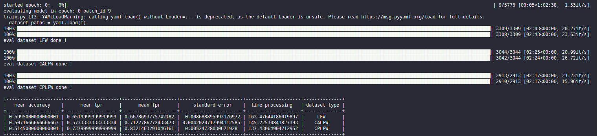

## Intro 

## Face Recognition base

 

# How to use 
- clone 
```
git clone https://github.com/docongminh/F-Vision.git
```
The Repo structure like the following like this:


# Training mode 
You can download dataset in [Training dataset](https://github.com/deepinsight/insightface/wiki/Dataset-Zoo)

## step 1. Training data 

Use dataset by stucture path to sub folder. Provide the face images your want to training the dataset/sub_foler/image. In [config.py](../face_recognition/config.py) 

And guarantee it have a structure like following:
```
[MS-Celeb-1M-vlc](http://trillionpairs.deepglint.com/data)
        ---> sub-folder1/
            ---> img1.jpg
            ---> img2.jpg
            ---> img3.jpg
        ---> sub-folder2/
            ---> img1.jpg
            ---> img2.jpg
            ---> img3.jpg
        ---> sub-folder3/
            ---> img1.jpg
            ---> img2.jpg
            ---> img3.jpg
```
In config.py you set path to training dataset like this: 
```
#_____________data training ___________________________________
data_root = '../MS-Celeb-ms1m' 
#help = "The root folder of training set."
``` 
## step 2.Configure the backbone 
Edit the configuration in [config.py](../face_recognition/config.py). More detailed description about the configuration can be found in [backbone_def.py](../face_recognition/backbone/backbone_def.py).   You can be found like this:  

```
model_parameter = {'ResNet': 
                      {'depth': 50,   # 50,100, or 152'
                      'drop_ratio': 0.4, 
                      'net_mode': 'ir',  # ['ir', 'ir_se']
                      'feat_dim': feat_dim, 
                      'out_h': 7, 
                      'out_w': 7},

                     'MobileFaceNet': 
                      {'feat_dim': feat_dim, 
                      'out_h': 7, 
                      'out_w': 7 }
                      } 

```
## step 3.Configure the loss model 
Edit the configure the loss in [config.py](../face_recognition/config.py). More detailed description about the configuration can be found in [losses_def.py](../face_recognition/losses/loss_def.py).   You can be found like this: 

```
loss_parameter = {'ArcFace':
                        {'feat_dim': feat_dim,
                        'num_class': num_class,
                        'margin_arc': 0.35,
                        'margin_am': 0.0,
                        'scale': 32},
                    'AM-Softmax':
                        {'feat_dim': feat_dim,
                        'num_class': num_class,
                        'margin': 0.35,
                        'scale': 32}
                    } 

```
## step 4. Download Evaluate dataset 
You can download clean dataset for evaluate in [Evaluate Dataset](https://drive.google.com/drive/folders/141PB0QiySNuhdm0C7iPpQK1nx_Ywf2ba?usp=sharing)

The structure of foler following like this: 
```
    ---> data_eval/ 
        ---> CALFW 
        ---> CPLFW
        ---> LFW 
```
And in [config.py](../face_recognition/config.py). You follow path to folder data_eval like this: 
```
dataset_paths = '/home/duydm/Documents/F-Vision/face_recognition/data_conf.yaml'
```
In data_conf.yaml have structure like this. Make sure like bellow. 

```
LFW:
    pairs_file_path: /home/duydm/Documents/F-Vision/face_recognition/trash/data_evaluate/LFW/pairs_LFW.txt
    cropped_face_folder: /home/duydm/Documents/F-Vision/face_recognition/trash/data_evaluate/LFW/lfw_crop
    image_list_file_path: /home/duydm/Documents/F-Vision/face_recognition/trash/data_evaluate/LFW/img_list_lfw.txt

CPLFW:
    pairs_file_path: /home/duydm/Documents/F-Vision/face_recognition/trash/data_evaluate/CPLFW/pairs_CPLFW.txt
    cropped_face_folder: /home/duydm/Documents/F-Vision/face_recognition/trash/data_evaluate/CPLFW/cplfw_crop
    image_list_file_path: /home/duydm/Documents/F-Vision/face_recognition/trash/data_evaluate/CPLFW/img_list_cplfw.txt

CALFW:
    pairs_file_path: /home/duydm/Documents/F-Vision/face_recognition/trash/data_evaluate/CALFW/pairs_CALFW.txt
    cropped_face_folder: /home/duydm/Documents/F-Vision/face_recognition/trash/data_evaluate/CALFW/calfw_crop
    image_list_file_path: /home/duydm/Documents/F-Vision/face_recognition/trash/data_evaluate/CALFW/img_list_calfw.txt

```
And you add type dataset in list dataset_type. 
```
dataset_type = ['LFW','CALFW' ,'CPLFW']
```
After you define in config.py file . You change the backbone and loss_type in bellow.  
```
#_________________ load backbone __________________ 
backbone_type =  'MobileFaceNet'    # MobileFaceNet, Resnet. If ResNet you must following 'mode should be ir or ir_se', deep layer: [50, 100, 152], 
loss_type = 'ArcFace'   # help = "Mobilefacenets, Resnet."   support for type loss "AM-Softmax, ArcFace"

```

## step 5. Pretrained and backbone 
You can download pretrain model for continue training. 
| Backbone | LFW | CPLFW | CALFW | AgeDb | MegaFace | Params | Macs | Models&Logs |
| :---: | :---: | :---: | :---: | :---: | :---: | :---: | :---: | :---: |
| [MobileFaceNet](https://arxiv.org/abs/1804.07573)   | 99.57 | 83.33 | 93.82 | 95.97 | 90.39 | 1.19M | 227.57M | [Google](https://drive.google.com/drive/folders/1v8G_y4JzoVaxXGlt3iLtd6TIk0GYwA2c?usp=sharing),[Baidu](https://pan.baidu.com/s/1RqBkIqd3zCdpUO50DHpOIw):bmpn |
| [Resnet50-ir](https://arxiv.org/abs/1512.03385)     | 99.78 | 88.20 | 95.47 | 97.77 | 96.67 | 43.57M | 6.31G | [Google](https://drive.google.com/drive/folders/1s1O5YcoFFy5godV1velyIwq_CcXDXUrz?usp=sharing),[Baidu](https://pan.baidu.com/s/1W7LAAQ9jtA9jojpsrjI1Fg):8ecq |
| [Resnet152-irse](https://arxiv.org/abs/1709.01507)  | 99.85 | 89.72 | 95.56 | 98.13 | 97.48 | 71.14M | 12.33G | [Google](https://drive.google.com/drive/folders/1FzXobevacaQ-Y1NAhMjTKZCP3gu4I3ni?usp=sharing),[Baidu](https://pan.baidu.com/s/10Fhgn9fjjtqPLXgrYTaPlA):2d0c |

## step 6. 
You can modify [config.py](../face_recognition/config.py) for workplace of model. Load pretrained, history training, and log in tensorboard. 

```
# ______________________ work place output model _____________________________

out_dir = '../Output_models/history/weights'  # help = "The place of folder to save models log history training"
log_dir = '../Output_models/history/log'  # help = 'The directory to save log.log'
pretrain_model = '../mobilefacenet/Epoch_17.pt' # help = 'The path of pretrained model'
tensorboardx_logdir = 'tensorboard'  # help = 'The directory to save tensorboardx logs'

```
## step 7. 
add this command line. 
```
python3 face_recognition/train.py
```
After runing this crip: the output model of evaluate like bellow: 

